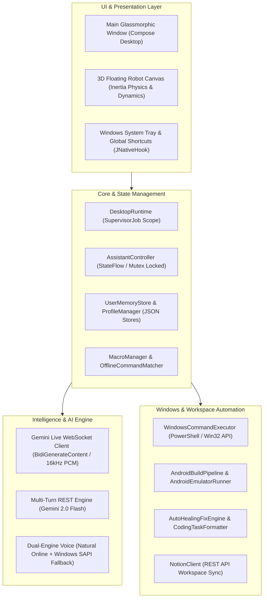
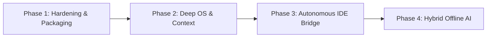

# VoiceBrainLive Desktop - Architecture & Future Roadmap

## 1. System Architecture Overview

VoiceBrainLive Desktop is an intelligent, voice-first desktop companion for Windows built with Kotlin and Jetpack Compose Multiplatform.

---

## 2. Core Modules & Responsibilities

| Module | Location | Primary Responsibility |
|---|---|---|
| **Main UI** | `com.example.voicebrainlive.desktop.Main.kt` | Modern dark glassmorphic dashboard, conversation log, audio waveforms, quick-action carousel, and settings modal. |
| **Floating Robot** | `com.example.voicebrainlive.desktop.FloatingRobotWindow.kt` | Transparent, borderless 3D interactive robot companion with magnetic boundary snapping, inertia physics, and emotional eye/mouth animations. |
| **Desktop Runtime** | `com.example.voicebrainlive.desktop.DesktopRuntime.kt` | Lifecycle coordinator, global hotkeys (`Ctrl+Alt+Space`), system tray notifications, and tool dispatch. |
| **Gemini Dual-Engine** | `com.example.voicebrainlive.desktop.platform.GeminiLiveSession.kt` | Real-time WebSocket streaming with multi-turn REST fallback, automated tool invocation, and vision/screen analysis. |
| **Audio Engine** | `com.example.voicebrainlive.desktop.platform.WindowsAudioEngine.kt` | 16kHz mono microphone capture, RMS volume metering, 24kHz jitter-buffered playback, and natural Burmese/English speech synthesis. |
| **Automation Suite** | `com.example.voicebrainlive.desktop.automation.*` | Autonomous bug fixing (`AutoHealingFixEngine`), Android build validation (`AndroidBuildPipeline`), emulator execution, and git commits. |
| **Workspace Sync** | `com.example.voicebrainlive.desktop.platform.NotionClient.kt` | Two-way sync with Notion pages, task boards, meeting notes, and auto-coding records. |

---

## 3. Stability & Reliability Implementation

1. **Gradle Build Resilience**:
   - HTTP connection timeouts (`60000ms`) and socket timeouts (`120000ms`) configured in `gradle.properties` to prevent network stalls during library resolutions.
   - Non-fatal configuration cache problem warnings enabled for high reproducibility.
2. **Audio Stream Mutex & Anti-Echo**:
   - Live WebSocket PCM audio and REST TTS are mutually exclusive via turn-state tracking (`liveAudioReceivedForTurn`), preventing duplicate voice echoes.
   - 50ms jitter pre-buffer ensures smooth continuous audio playback without clicks.
3. **PowerShell Process Lifecycles**:
   - Explicit timeouts (15–18s) and process destruction hooks ensure zero orphaned background PowerShell processes.
4. **Clean Workspace Sanitation**:
   - Build logs are isolated in `logs/`, and standard `.gitignore` prevents uncommitted local artifacts.

---

## 4. Future Development Roadmap

### 🔹 Phase 1: Hardening & Production Packaging (Current Milestone)
- [x] Consolidate loose log files and enforce `.gitignore`.
- [x] Configure Gradle network timeouts and configuration cache resilience.
- [x] Verify Native Compose packaging (`packageMsi` and `.exe` distribution).
- [ ] Implement automatic daily log rotation.

### 🔹 Phase 2: Deep OS & Context Awareness
- [x] **Active Window Context**: Real-time foreground window & process tracker (`ActiveWindowTracker`), app categorization, and project/file inference.
- [ ] **Accessibility & UI Automation Hook**: Inspect Windows accessibility tree to read UI controls without full screen screenshots.
- [ ] **Custom Macro Visual Builder**: Allow users to record multi-step desktop actions directly from the Main Window.

### 🔹 Phase 3: Autonomous IDE Integration & Coding Agent
- [x] **IDE Bridge Service**: Local editor integration (`IdeBridgeService`) with line-level navigation (`code -g`, `studio64 --line`), IDE process tracking, and status inspection.
- [x] **Wireless ADB Auto-Pairing**: Pair and deploy to Android devices seamlessly over Wi-Fi (`WirelessAdbManager` supporting `adb tcpip`, `adb connect`, and `adb pair`).
- [x] **Multi-Repo Management**: Discover and manage multiple git repositories (`MultiRepoManager`), branch switching, dirty status, and pull sync.

### 🔹 Phase 4: Hybrid Offline AI & Local Voice
- [ ] **Local Whisper STT**: Integrated Whisper.cpp / ONNX runtime for offline voice recognition.
- [ ] **Local LLM Fallback**: Ollama / Llama.cpp fallback for basic desktop control and file search without internet access.
- [ ] **Offline Piper TTS**: High-speed offline neural speech synthesis.
